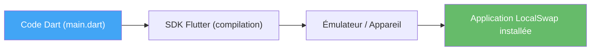

# TP1 — Découverte de Flutter/Dart et lancement du projet LocalSwap

## Objectifs
- Comprendre ce qu'est Flutter et ce qu'est Dart, et pourquoi ils sont liés.
- Installer un environnement de développement complet et fonctionnel.
- Créer et exécuter une première application Flutter.
- Lancer officiellement le projet fil rouge du semestre : **LocalSwap**.

## Prérequis
- Notions de base de la programmation orientée objet.

---

## Rappel de cours — Notions et définitions

**Qu'est-ce que Flutter ?** Framework open-source de Google permettant de développer des applications natives multiplateformes (Android, iOS, Web, Desktop) à partir d'une seule base de code.

**Qu'est-ce que Dart ?** Langage de programmation créé par Google, orienté objet, à typage statique optionnel, compilé (AOT en production, JIT en développement), sur lequel repose Flutter.

**Environnements de développement** : la configuration diffère légèrement selon le système (GNU/Linux, Windows, macOS), mais repose toujours sur : le SDK Flutter, un IDE (Android Studio ou VS Code), un émulateur ou appareil physique.

**Première application** : toute application Flutter démarre par une fonction `main()` qui appelle `runApp()`, avec un widget racine (généralement `MaterialApp`).

**Hot Reload** : réinjection du code modifié dans l'application en cours d'exécution, sans perte d'état — le principal gain de productivité de Flutter.

## Diagramme — De Dart à l'application installée



---

## Partie A — Prise en main guidée

### Exercice 1.1 — Installation et vérification de l'environnement
**Objectif :** obtenir un environnement Flutter opérationnel avant toute écriture de code.

1. Installer le SDK Flutter (téléchargement de l'archive ou gestionnaire de paquets selon l'OS) et l'ajouter au `PATH`.
2. Installer Android Studio, puis les plugins *Flutter* et *Dart* depuis le marketplace de plugins.
3. Créer et démarrer un émulateur Android (AVD Manager) **ou** activer le mode développeur/débogage USB sur un appareil physique.
4. Dans un terminal, exécuter :
   ```bash
   flutter doctor -v
   ```
5. Corriger une à une les alertes affichées (licences Android non acceptées → `flutter doctor --android-licenses`, SDK manquant, etc.), jusqu'à obtenir un maximum de coches vertes.

**Résultat attendu :** une capture d'écran du terminal montrant une sortie `flutter doctor` propre (ou avec seulement des alertes non bloquantes justifiées).

### Exercice 1.2 — Premier projet et premier lancement
**Objectif :** créer, comprendre et exécuter un projet Flutter minimal.

1. Créer un projet de test :
   ```bash
   flutter create demo_app
   cd demo_app
   ```
2. Lancer l'application sur l'émulateur/appareil connecté :
   ```bash
   flutter run
   ```
3. Observer l'application par défaut (compteur avec bouton "+").
4. Cliquer plusieurs fois sur le bouton "+" et constater l'incrémentation à l'écran.

**Question de compréhension :** à quel widget racine correspond l'écran affiché (`MaterialApp` ? `Scaffold` ? `MyHomePage` ?) — identifier ces trois widgets dans `main.dart` sans encore les modifier.

### Exercice 1.3 — Modification du code et Hot Reload
**Objectif :** expérimenter concrètement le Hot Reload et comprendre ce qu'il préserve (ou non).

1. Application toujours en cours d'exécution (`flutter run` actif), incrémenter le compteur 3 fois.
2. Dans `main.dart`, modifier le texte `'You have pushed the button this many times:'` par un texte personnalisé, **sans arrêter l'application**.
3. Sauvegarder le fichier et observer le rafraîchissement automatique (ou appuyer sur `r` dans le terminal / bouton éclair dans l'IDE).
4. **Constat à noter :** le compteur a-t-il gardé sa valeur après le Hot Reload ? Pourquoi (lien avec la préservation de l'état) ?
5. Refaire le test avec un **Hot Restart** (`R` majuscule / bouton dédié) : que devient le compteur cette fois ? En déduire la différence entre Hot Reload et Hot Restart.

### Exercice 1.4 — Exploration guidée de l'arborescence du projet
**Objectif :** savoir se repérer dans un projet Flutter généré.

Ouvrir et identifier le rôle de chacun des éléments suivants (répondre en une phrase par élément dans un compte-rendu) :
- `lib/main.dart` : point d'entrée, fonctions `main()` et `runApp()`.
- `pubspec.yaml` : nom du projet, version, section `dependencies`.
- `pubspec.lock` : à quoi sert-il, doit-il être modifié à la main ?
- `android/` et `ios/` : à quoi servent ces dossiers (à ouvrir, pas nécessairement à modifier à ce stade) ?
- `test/` : dossier réservé aux tests (reviendra en détail plus tard dans le semestre).

### Exercice 1.5 — Comparaison Material / Cupertino (mise en bouche)
**Objectif :** observer concrètement la différence de style entre les deux familles de widgets, avant de les approfondir au TP3.

1. Dans l'écran par défaut, ajouter côte à côte un `ElevatedButton` (Material) et un `CupertinoButton` (import `package:flutter/cupertino.dart`) affichant le même texte "Voir".
2. Lancer l'application et comparer visuellement les deux rendus.
3. Noter en une ligne la différence de style observée (forme, couleur, comportement au clic).

## Partie B — Lancement du projet LocalSwap

**Présentation du projet fil rouge du semestre :**

> **LocalSwap** : application mobile de troc et d'entraide de quartier. Les habitants publient des annonces (objets, services, covoiturage), les réservent, puis finalisent l'échange. Un système de réputation valorise les utilisateurs actifs.

C'est le **seul projet** du semestre : chaque TP le fait progresser.

**Travail à réaliser :**
1. Créer le projet officiel : `flutter create localswap`.
2. Initialiser le dépôt Git (`.gitignore` Flutter, premier commit).
3. Renommer l'application affichée en "LocalSwap" (`title:` dans `MaterialApp`).
4. Créer un écran d'accueil minimal (`Scaffold` + `AppBar` "LocalSwap").

## Livrables
- Dépôt Git `localswap` avec premier commit.
- Capture d'écran de l'application affichant "LocalSwap" et du Hot Reload en action.

## Grille d'évaluation

| Critère | Points |
|---|---|
| Environnement fonctionnel (`flutter doctor` propre) | 5 |
| Projet `localswap` créé et versionné | 7 |
| Écran d'accueil affiché correctement | 8 |
| **Total** | **20** |
