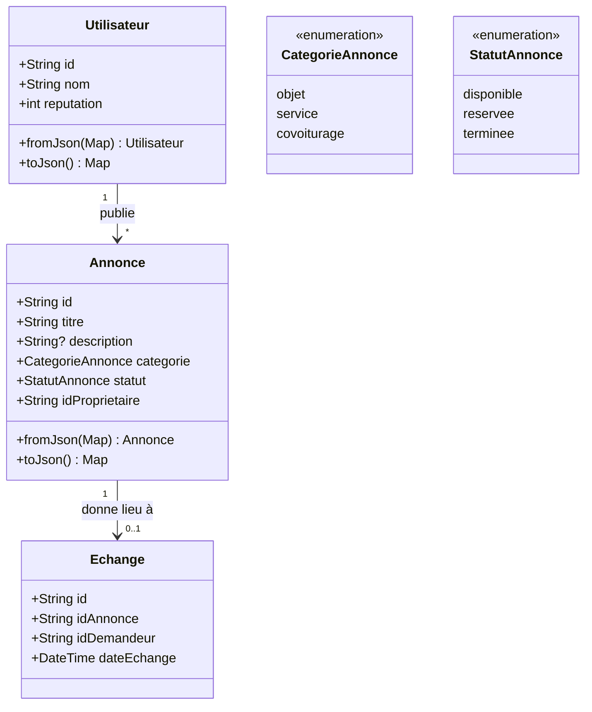

# TP2 — Les bases de Dart pour Flutter (approfondissement)

## Objectifs
- Maîtriser variables, listes, maps, fonctions et structures de contrôle en Dart.
- Modéliser les entités métier de LocalSwap avec des classes Dart.
- Comprendre les imports/exports et la programmation asynchrone.

## Prérequis
- TP1 terminé.

---

## Rappel de cours — Notions et définitions

**Variables** : `var`, `final`, `const`, typage explicite ou inféré, null safety (`?`, `late`, `required`, `!`, `??`).

**Listes et Maps** : `List<T>` (collection ordonnée), `Map<K,V>` (paires clé-valeur) ; méthodes courantes : `map()`, `where()`, `forEach()`, opérateur *spread* (`...`).

**Fonctions** : fonctions nommées, fonctions fléchées (`=>`), paramètres positionnels/nommés/optionnels.

**Structures de contrôle** : `if/else`, `switch`, boucles `for`, `for-in`, `while`.

**Classes** : constructeurs (par défaut, nommés, `.fromJson()`), attributs, méthodes, `enum` pour représenter un ensemble fini de valeurs (ex. statut d'une annonce).

**Imports et exports** : `import 'package:...'` pour utiliser un fichier/bibliothèque externe, `export` pour ré-exposer un fichier depuis un autre (utile pour organiser un projet en modules, ex. regrouper tous les modèles LocalSwap dans un seul point d'entrée `models.dart`).

**Asynchrone** : `Future<T>` représente une valeur disponible plus tard ; `async`/`await` permettent d'écrire du code asynchrone de façon linéaire, indispensable dès qu'on simule ou effectue un accès réseau/base de données.

## Diagramme — Modèle de données LocalSwap

---

## Partie A — Guidée

*Tous les exercices de cette partie peuvent être réalisés dans DartPad (https://dartpad.dev) ou dans un fichier `.dart` autonome exécuté avec `dart run`, indépendamment du projet Flutter.*

### Exercice 2.1 — Variables, typage et null safety
**Objectif :** manipuler `var`, `final`, `const` et les opérateurs de null safety.

1. Déclarer une variable `var nom = 'LocalSwap';` puis tenter de lui réaffecter un entier : observer et expliquer l'erreur (inférence de type).
2. Déclarer `final String slogan = "Partagez, échangez, aidez";` puis tenter de la réassigner : observer l'erreur et expliquer la différence avec `const`.
3. Déclarer `const int nombreMaxCategories = 3;` et expliquer pourquoi cette valeur pourrait être `const` alors que `slogan` ne peut être que `final` (indice : dépend-elle d'un calcul à l'exécution ?).
4. Déclarer une variable nullable `String? commentaire;` puis :
   - Tenter de l'utiliser directement dans une concaténation (`'Commentaire : ' + commentaire`) : observer l'erreur.
   - Corriger avec l'opérateur `??` pour fournir une valeur par défaut ("Aucun commentaire").
   - Corriger différemment avec l'opérateur `!` en s'assurant d'abord que la variable n'est pas nulle avec un test `if`.
5. Écrire une fonction `String afficherCommentaire(String? c) => c ?? 'Aucun commentaire';` et la tester avec `null` et avec une vraie chaîne.

### Exercice 2.2 — Listes et Maps
**Objectif :** manipuler des collections, condition de base à la gestion des annonces.

1. Créer une liste de catégories : `List<String> categories = ['objet', 'service', 'covoiturage'];`.
2. Afficher chaque catégorie en majuscules avec `.map()` puis convertir le résultat en `List<String>` avec `.toList()`.
3. Créer une `List<int>` de "durées de prêt en jours" `[3, 7, 1, 14, 5]` puis :
   - Filtrer avec `.where()` les durées supérieures à 5 jours.
   - Calculer la durée moyenne avec une boucle `for`, puis refaire le calcul avec `.reduce()`.
4. Créer une `Map<String, int>` associant chaque catégorie à un nombre fictif d'annonces (`{'objet': 12, 'service': 5, 'covoiturage': 3}`), puis :
   - Afficher chaque paire clé/valeur avec `.forEach()`.
   - Trouver la catégorie ayant le plus d'annonces (sans bibliothèque externe, avec une boucle).
5. Fusionner deux listes de catégories avec l'opérateur *spread* `...` (ex. catégories "de base" + une catégorie "événement" ajoutée dynamiquement).

### Exercice 2.3 — Fonctions
**Objectif :** écrire des fonctions sous différentes formes.

1. Écrire une fonction classique `bool estCategorieValide(String categorie)` qui retourne `true` si la catégorie appartient à la liste `['objet', 'service', 'covoiturage']`.
2. Réécrire cette même fonction en **fonction fléchée** (`=>`).
3. Écrire une fonction avec **paramètres nommés obligatoires** : `String formaterAnnonce({required String titre, required String categorie})` qui retourne une chaîne formatée `"[categorie] titre"`.
4. Écrire une fonction avec **paramètre optionnel positionnel** : `String saluer(String nom, [String civilite = 'Bonjour'])`.
5. Tester chaque fonction avec au moins 2 jeux de données différents et afficher les résultats avec `print()`.

### Exercice 2.4 — Structures de contrôle
**Objectif :** manipuler conditions et boucles sur un petit jeu de données représentatif.

1. Créer une liste de "statuts" fictifs `['disponible', 'reservee', 'terminee', 'disponible', 'terminee']`.
2. Avec une boucle `for-in` et un `switch`, afficher pour chaque statut un message différent ("✅ Disponible", "🕒 En cours", "✔️ Terminée").
3. Avec une boucle `while`, compter combien d'annonces sont `'disponible'` dans la liste.
4. Réécrire ce comptage avec une boucle `for` classique (indexée), puis comparer les deux approches (laquelle est la plus lisible ici ?).

### Exercice 2.5 — Première classe avec constructeur et sérialisation
**Objectif :** poser les bases de la modélisation objet avant l'application complète en Partie B.

1. Créer une classe simple `Ville` avec deux attributs `String nom` et `String codePostal`, et un constructeur classique.
2. Ajouter un second constructeur nommé `Ville.fromJson(Map<String, dynamic> json)` qui initialise les attributs à partir de la map.
3. Ajouter une méthode `Map<String, dynamic> toJson()` qui retourne la map inverse.
4. Tester : créer une instance, appeler `.toJson()`, afficher le résultat, puis recréer un objet à partir de ce JSON avec `.fromJson()` et vérifier l'égalité des attributs.

### Exercice 2.6 — Organisation en modules (import/export)
**Objectif :** comprendre comment structurer un projet Dart/Flutter en plusieurs fichiers.

1. Créer deux fichiers : `ville.dart` (contenant la classe `Ville` de l'exercice 2.5) et `main_test.dart`.
2. Dans `main_test.dart`, importer la classe avec `import 'ville.dart';` et instancier un objet.
3. Créer un troisième fichier `modeles.dart` qui `export` `ville.dart`, puis modifier `main_test.dart` pour importer uniquement `modeles.dart` : vérifier que tout fonctionne toujours.

### Exercice 2.7 — Programmation asynchrone
**Objectif :** manipuler `Future`, `async`/`await` avant de les appliquer à un vrai scénario réseau.

1. Écrire une fonction `Future<String> chargerMessage() async { await Future.delayed(Duration(seconds: 2)); return "Message chargé"; }`.
2. L'appeler depuis une fonction `main() async` avec `await` et afficher un message *avant* et *après* l'appel, pour observer concrètement le délai.
3. Modifier la fonction pour qu'elle retourne une `List<String>` de 3 éléments simulant des données chargées.
4. Ajouter une gestion d'erreur simple avec `try/catch` autour de l'appel `await`, en simulant une erreur avec `throw Exception('Échec du chargement');` dans certains cas (ex. un paramètre booléen `simulerErreur`).

## Partie B — Application au projet LocalSwap

1. Créer un dossier `lib/models/` avec les fichiers `utilisateur.dart`, `annonce.dart`, `echange.dart`, et un fichier `models.dart` qui les `export`.
2. Implémenter les 3 classes (voir diagramme), avec `enum CategorieAnnonce` et `enum StatutAnnonce`.
3. Écrire une fonction asynchrone `chargerAnnonces()` simulant le chargement de 5 annonces de test.
4. Écrire une fonction pure `peutReserver(Annonce annonce)` retournant `true` uniquement si le statut est `disponible`.

## Livrables
- Dossier `lib/models/` complet et fonctionnel (import/export).
- Fonctions `chargerAnnonces()` et `peutReserver()`.

## Grille d'évaluation

| Critère | Points |
|---|---|
| Maîtrise des bases Dart (variables, boucles, fonctions) | 6 |
| Modélisation correcte des 3 classes | 6 |
| Organisation en modules (import/export) | 4 |
| Fonction asynchrone correcte | 4 |
| **Total** | **20** |
