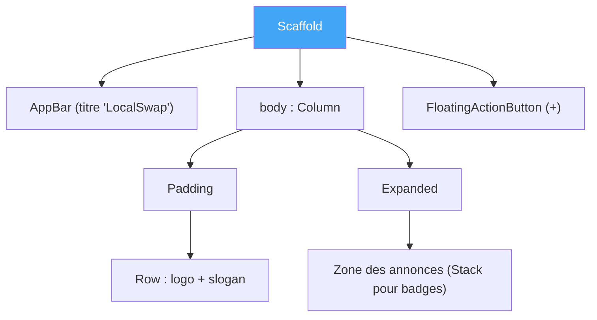

# TP3 — Widgets fondamentaux, layout et Material

## Objectifs
- Comprendre ce qu'est un widget et ses propriétés.
- Maîtriser les widgets `Text`, `Image` et les widgets de mise en page (`Container`, `Padding`, `Center`, `Column`, `Expanded`, `Row`, `Stack`).
- Construire une application Material avec `Scaffold`, `AppBar`, `FloatingActionButton`.
- Bâtir l'écran d'accueil de LocalSwap.

## Prérequis
- TP2 terminé (modèles de données disponibles).

---

## Rappel de cours — Notions et définitions

**Qu'est-ce qu'un widget ?** Unité de base de toute interface Flutter — *"tout est un widget"*. Un widget est décrit par ses **propriétés**, transmises à la construction, et peut contenir d'autres widgets (composition).

**`Text` et `Image`** : widgets d'affichage de contenu — texte stylé (`TextStyle`) ou image (réseau, assets, fichier).

**Système de layout** : chaque widget de mise en page a une règle de disposition précise :
- `Container` : boîte avec dimensions, marges, couleur, décoration (`BoxDecoration`).
- `Padding` : ajoute un espace intérieur autour d'un widget enfant.
- `Center` : centre son enfant dans l'espace disponible.
- `Column`/`Row` : empilent leurs enfants verticalement/horizontalement.
- `Expanded` : force un enfant de `Column`/`Row` à occuper l'espace restant disponible.
- `Stack` : superpose ses enfants (utile pour un badge par-dessus une icône, par exemple).

**Applications Material** : `MaterialApp` fournit le thème, la navigation et les composants visuels Material Design.

**`Scaffold`** : structure de page standard Material (barre supérieure, corps, boutons flottants, tiroir de navigation...).
- `AppBar` : barre supérieure (titre, actions, icônes).
- `FloatingActionButton` (FAB) : bouton d'action flottant, généralement pour l'action principale de l'écran (ex. "ajouter").

**Thème et `MediaQuery`** (notions complémentaires) : `Theme.of(context)` donne accès aux couleurs/styles globaux de l'application ; `MediaQuery.of(context)` donne accès aux dimensions de l'écran, utile pour adapter un layout à différentes tailles d'appareil.

## Diagramme — Structure de l'écran d'accueil LocalSwap

---

## Partie A — Guidée

### Exercice 3.1 — Widget `Text` et propriétés de style
**Objectif :** comprendre la notion de propriété d'un widget.

1. Dans une application Flutter vide (`flutter create widgets_demo`), remplacer le corps de l'écran par un simple `Text('Bonjour LocalSwap')`.
2. Ajouter un `style: TextStyle(...)` en faisant varier `fontSize`, `fontWeight`, `color`, `fontStyle` (italique), et observer chaque changement après Hot Reload.
3. Ajouter un second `Text` avec `textAlign: TextAlign.center` à l'intérieur d'un `Container` de largeur fixe, pour observer l'effet de l'alignement.
4. **Question :** pourquoi ne peut-on pas modifier un `Text` déjà créé (`text.value = '...'`) comme on le ferait avec une variable classique ? Relier la réponse à l'immutabilité des widgets.

### Exercice 3.2 — Widget `Image`
**Objectif :** afficher une image depuis différentes sources.

1. Afficher une image depuis une URL avec `Image.network('https://...')`.
2. Ajouter une image locale : créer un dossier `assets/images/`, y placer un logo, le déclarer dans `pubspec.yaml` (section `flutter: assets:`), puis l'afficher avec `Image.asset('assets/images/logo.png')`.
3. Comparer les deux approches : que se passe-t-il si le réseau est indisponible avec `Image.network` ? Ajouter un `errorBuilder` pour gérer ce cas.
4. Faire varier `fit: BoxFit.cover/contain/fill` sur une image placée dans un `Container` de taille fixe, et noter la différence visuelle de chaque valeur.

### Exercice 3.3 — Container, Padding et Center
**Objectif :** maîtriser les trois widgets de base de la mise en forme.

1. Créer un `Container` de 200x100, couleur de fond bleue, et lui ajouter des coins arrondis + une ombre via `BoxDecoration` (`borderRadius`, `boxShadow`).
2. Envelopper un `Text` dans un `Padding` avec `EdgeInsets.all(16)`, puis avec `EdgeInsets.symmetric(horizontal: 24, vertical: 8)` : comparer les deux rendus.
3. Utiliser `Center` pour centrer un `Container` dans tout l'écran, puis observer ce qui se passe si l'on retire `Center` (le `Container` se colle-t-il toujours au centre ?).
4. Combiner les trois : un `Center` contenant un `Padding` contenant un `Container` avec un `Text` à l'intérieur (mini "carte" de test).

### Exercice 3.4 — Column, Row, Expanded
**Objectif :** construire des agencements combinant plusieurs widgets.

1. Créer une `Column` avec 3 `Text` différents (titre, sous-titre, description), en jouant sur `mainAxisAlignment` (`start`, `center`, `spaceBetween`) pour observer les différences de répartition verticale.
2. Créer une `Row` avec une icône (`Icon`) et un `Text` côte à côte, alignés verticalement avec `crossAxisAlignment: CrossAxisAlignment.center`.
3. Dans une `Row` contenant 2 `Container` de couleurs différentes, envelopper l'un des deux dans un `Expanded` : observer comment il occupe l'espace restant. Ajouter un second `Expanded` avec un `flex: 2` sur l'autre `Container` et observer la répartition proportionnelle.
4. Construire une mise en page mixte : une `Column` contenant un en-tête (`Row` avec icône + titre) puis un `Expanded` contenant une zone de contenu (simple `Container` coloré pour l'instant).

### Exercice 3.5 — Stack (superposition)
**Objectif :** superposer des widgets, technique nécessaire pour les badges de statut du TP4.

1. Superposer un `Icon` (grand) et un petit `Container` rond coloré positionné en haut à droite avec `Positioned` à l'intérieur d'un `Stack`, pour simuler un badge de notification.
2. Faire varier les propriétés de `Positioned` (`top`, `right`, `bottom`, `left`) et observer l'effet sur le positionnement du badge.
3. Ajouter un `Text` (ex. "3") à l'intérieur du badge, pour obtenir un rendu proche d'un compteur de notifications.

### Exercice 3.6 — Scaffold, AppBar et FloatingActionButton
**Objectif :** assembler une page Material complète.

1. Créer un `Scaffold` avec `appBar: AppBar(title: Text('Ma page'))`.
2. Ajouter des icônes d'action dans l'`AppBar` (`actions: [IconButton(...)]`), par exemple une icône de recherche et une icône de notifications.
3. Ajouter un `FloatingActionButton` avec une icône "+" et un `onPressed` qui affiche pour l'instant une simple `SnackBar` ("Bouton pressé") — juste pour vérifier que l'action réagit.
4. Faire varier `floatingActionButtonLocation` (`centerFloat`, `endFloat`) et observer les différences.

## Partie B — Application au projet LocalSwap

1. Concevoir l'écran d'accueil définitif avec `Scaffold` : `AppBar` "LocalSwap", `FloatingActionButton` "+" (destiné plus tard à la publication d'une annonce).
2. Structurer le corps de l'écran avec `Column`/`Expanded` : un en-tête (logo/slogan LocalSwap) puis une zone réservée à la future liste d'annonces (TP4).
3. Créer un premier gabarit visuel de la carte d'annonce (sans logique encore) en combinant `Container`, `Padding`, `Row`, `Stack` (pour superposer un badge de catégorie).
4. Définir un `ThemeData` global (couleurs principales de LocalSwap) dans `MaterialApp`.

## Livrables
- Écran d'accueil `Scaffold` complet avec AppBar/FAB.
- Gabarit visuel de carte d'annonce (statique).
- Thème global défini.

## Grille d'évaluation

| Critère | Points |
|---|---|
| Maîtrise des widgets de layout | 6 |
| Écran d'accueil Scaffold/AppBar/FAB correct | 8 |
| Gabarit de carte d'annonce cohérent | 4 |
| Thème global appliqué | 2 |
| **Total** | **20** |
